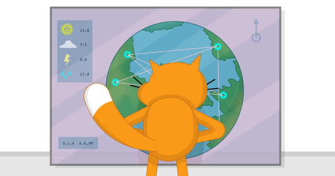

# WeatherStation Dashboard

In this resource you will use the provided Python script to connect Weather Stations all around the world to your Scratch project, and then visualise some of their sensor data.

## Licence

Unless otherwise specified, everything in this repository is covered by the following licence:

***Weather Station Dashboard*** by the [Raspberry Pi Foundation](http://www.raspberrypi.org) is licenced under a [Creative Commons Attribution 4.0 International License](http://creativecommons.org/licenses/by-sa/4.0/).

Based on a work at https://github.com/raspberrypilearning/weather-station-dashboard
