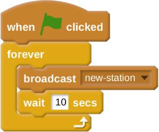
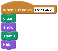
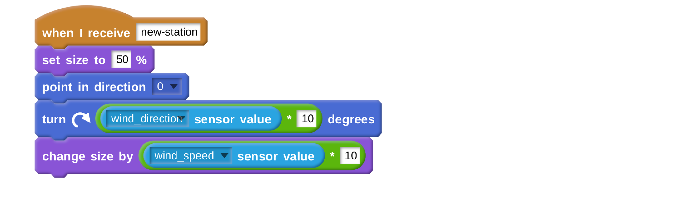

# The Scratch Weather Dashboard

In this relatively short worksheet, you'll learn how to access random weather stations from all around the world.

## The Python script.

1. Make sure your Python script is still running in the background.
1. The script is constantly listening out for a `broadcast` with the name `new-station`. Each time the script here's the `new-station broadcast` it chooses a new and random station to collect the data from.

## Getting A New Station

You can start on the last sprite you created - the one that was just a single dot in the middle of the page. All you need to do in this script is create a loop that broadcasts `new-station` every 10 seconds or so. (You can choose your own timing).

## Removing the flags.

For all your other sprites, you just need to change the `green flag clicked` blocks for `when I receive new-station` blocks.

## Running your script.

When you click on the green flag, your script should start working straight away. It will tell you which area the station is, and then the latest temperature and wind readings.

## What Next?

There are lots of other sensors that you could have a go at visualising in the dashboard. Why not have a look at humidity, or try to make a visualisation of a barometer to tell you the air pressure. Perhaps you could show a little column of water to visualise how much rain has fallen.

If you'd like to have a go at some other weather station resources, then you can have a look at [Fetching the Weather](https://raspberrypi.org/learning/fetching-the-weather), to have a go at accessing weather data in Python.
